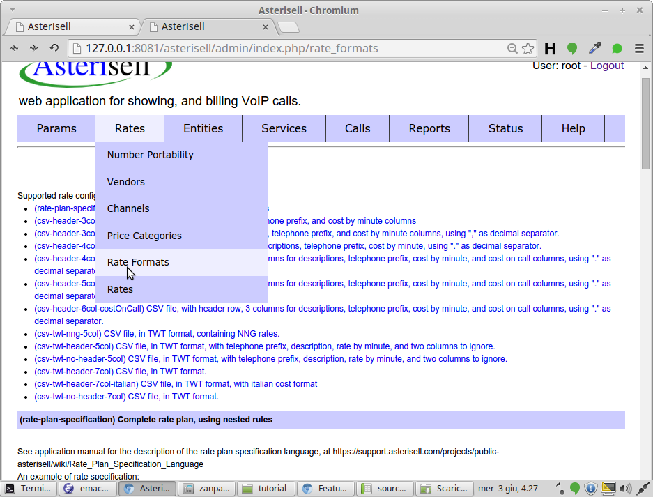
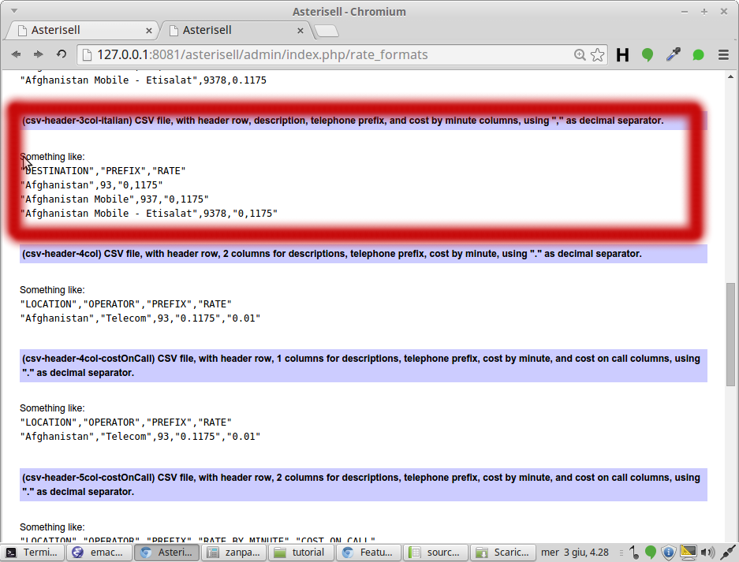
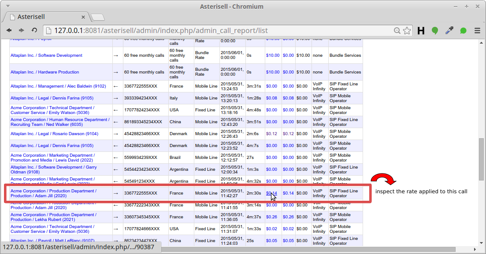
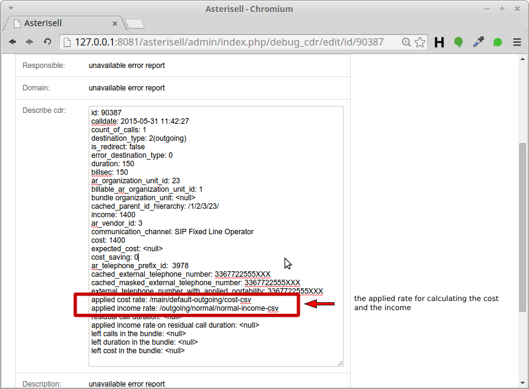
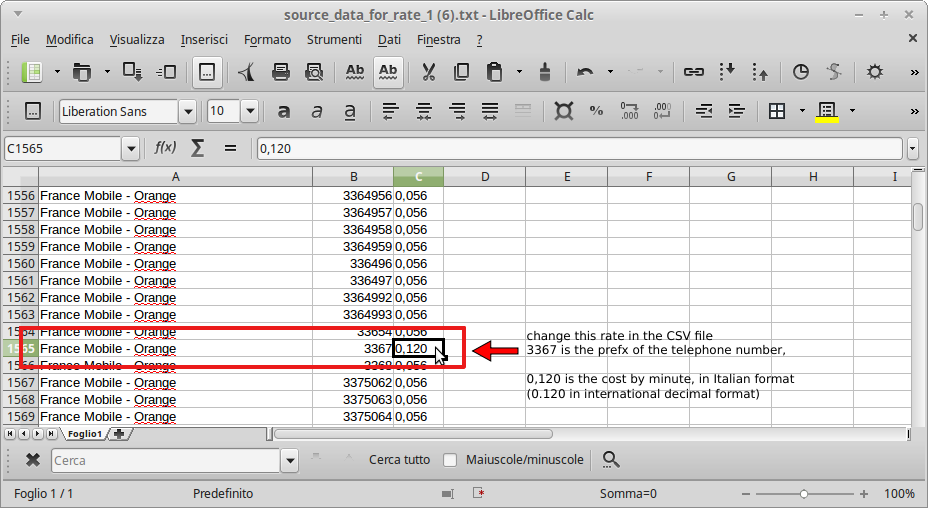
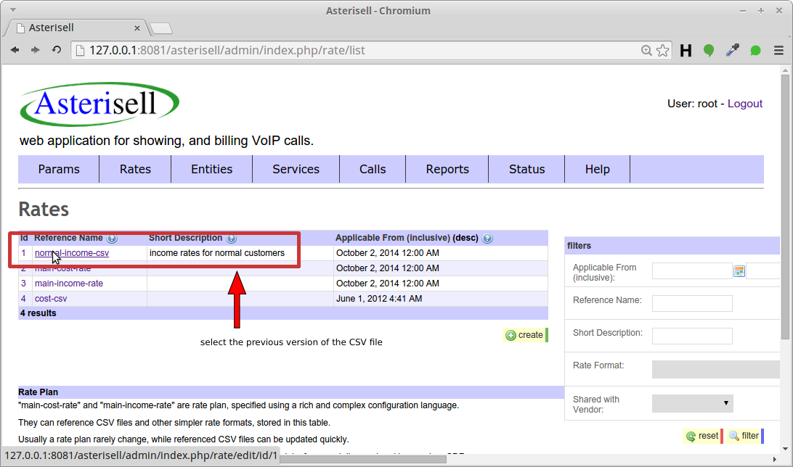
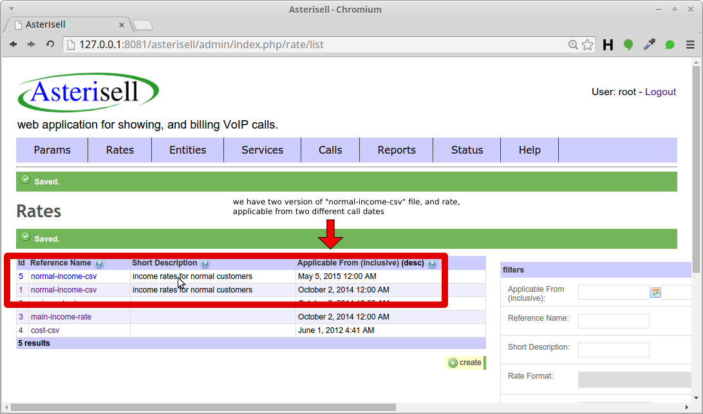
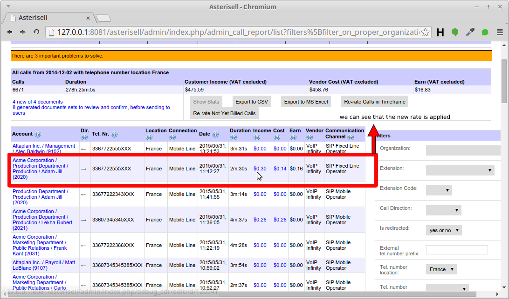
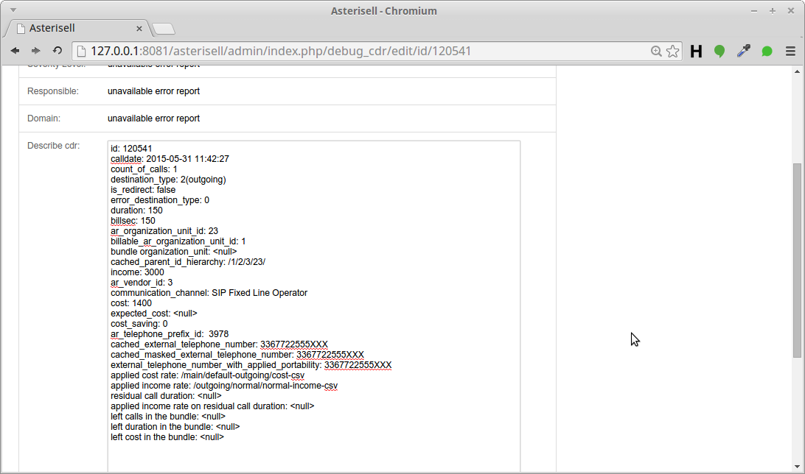

# CSV rate plan example

This is a CSV rate, with prices specified by minute, and applied by
second. The prices are in Italian format: with "," as decimal separator.

We check if the rate format is one of the supported formats

Yes it is supported:

In case it is not supported, you can:

  - contact the assistance, for adding the format to the application
  - convert the CSV file to one of the supported formats

Now we open the `Rates -> Rates` menu, and we create a new rate. We
upload the CSV file, specifying also its format.

The CSV file alone is not sufficient for rating the calls. We had to
specify a rate plan, classifying the calls by type, and applying the
correct rating method. The default name for these rates is
`main-income-rate`, and the default type is `rate-plan-specification`.
Don't worry: if you don't specify this rate, the application will advise
you.

So in `Rates -> Rates` we insert

and we specify this rate plan

After specifying it, Asterisell schedules an automatic rerating of
unbilled calls.

Every rating error is reported.

We can inspect a rated call

Usually price-lists changes over time. We can modify the CSV file:

Now we upload the new version of CSV file, selecting the current version

We upload the new version, specifying the date on which it takes effect:

We can see that there are the two version of the same CSV file,
applicable at different call-dates:

We have not touched the `main-income-rate`, because usually the main
rate plan does not change, but only the CSV files with the details of
the rates.

An automatic rerating is scheduled, and we can inspect the differences

